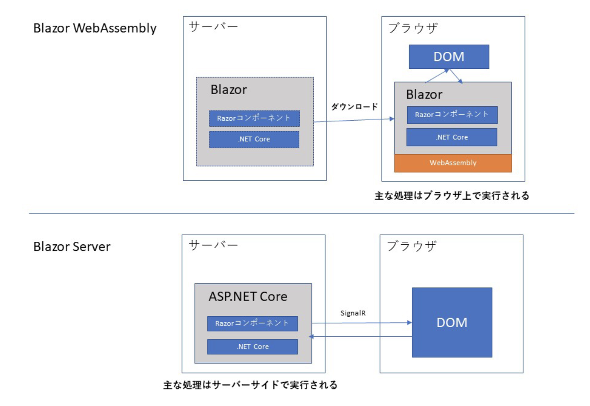

# WIP : Blazor を使った ToDo List アプリケーション

## 目的

Blazor を使ったアプリケーションの作成から、 ORM を使って SQL Server に接続するまでの大まかな流れを確認する。

## 前提

```powershell
$ dotnet --version
5.0.203
```

## Blazor とは

Blazor とは、 C# と HTML を使用して Web アプリケーションを作成できるようにするオープンソースの Web フレームワーク。
サーバーサイドで動作する Blazor Server と、ブラウザ上で動作する Blazor WebAssembly の 2 つのモデルがある。



Blazor Server では、サーバー上の .NET Core 環境で主な処理が行われ、サーバー側のコードでブラウザーのコンテンツ (DOM) を書き換える。サーバーとブラウザ間のやりとりには、 ASP.NET Core SignalR というライブラリが用いられる。

一方、 Blazor WebAssembly は、 WebAssembly を利用して、ブラウザ内で .NET コードを実行する。 WebAssembly とは、ブラウザ上でバイナリコードを実行できるようにする技術のこと（プラグイン不要、 IE は未対応）。

## アプリケーションの作成

Blazor アプリケーションの作成

```dotnetcli
$ dotnet new blazorserver
```

`Todo` Razor コンポーネントの追加

```dotnetcli
$ dotnet new razorcomponent -n Todo -o Pages
The template "Razor Component" was created successfully.
```
→`./Pages` 配下に `Todo.razor` が作成される。
<b>※Razor コンポーネントファイル名の先頭文字は、大文字である必要がある。</b>

## Blazor プロジェクト構造

[こちら](https://docs.microsoft.com/ja-jp/aspnet/core/blazor/project-structure?view=aspnetcore-5.0)を参照すること。

## Install SQL Server on macOS

```powershell
$ sudo docker pull microsoft/mssql-server-linux:2017-latest
$ docker run -e 'HOMEBREW_NO_ENV_FILTERING=1' -e 'ACCEPT_EULA=Y' -e 'SA_PASSWORD=yourStrong(!)Password' -p 1433:1433 -d microsoft/mssql-server-linux
```

SQL Server の Username / Password は下記の通り。

| Username | Password |
| :---: | :---: |
| sa | yourStrong(!)Password |

## Tips

### dotnet core プロジェクト用の gitignore の作成方法

```powershell
dotnet new gitignore
```

## References

- [Create C# apps using SQL Server on macOS](https://www.microsoft.com/en-us/sql-server/developer-get-started/csharp/macos)